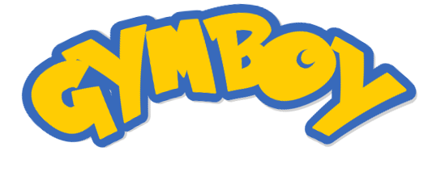
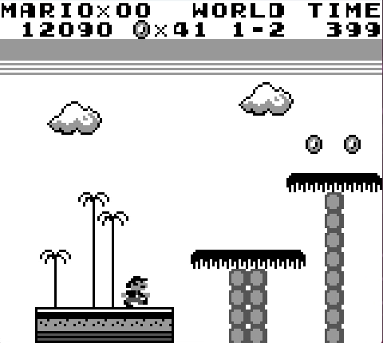

<p align="center"></p>

<h1 align="center">Gameboy (Color) Environments in Gymnasium 🤖</h1>

<p align="center">
  
  
  
  
</p>

Gymboy supports a range of different RL environments from the Game Boy Color using the Gymnasium API.

## Implemented Environments 🌍
| Environment Name                      | Python Source                                                                                                             |
|---------------------------------------|---------------------------------------------------------------------------------------------------------------------------|
| `Kirby-Dream-Land-1-flatten-v1`       | [Click](https://github.com/nobodyPerfecZ/gymboy/blob/master/gymboy/environments/kirby/dream_land_1/kirby_dream_land_1.py) |
| `Kirby-Dream-Land-1-minimal-image-v1` | [Click](https://github.com/nobodyPerfecZ/gymboy/blob/master/gymboy/environments/kirby/dream_land_1/kirby_dream_land_1.py) |
| `Kirby-Dream-Land-1-full-image-v1`    | [Click](https://github.com/nobodyPerfecZ/gymboy/blob/master/gymboy/environments/kirby/dream_land_1/kirby_dream_land_1.py) |
| `Pokemon-Blue-flatten-v1`             | [Click](https://github.com/nobodyPerfecZ/gymboy/blob/master/gymboy/environments/pokemon/gen_1/blue.py)                    |
| `Pokemon-Blue-minimal-image-v1`       | [Click](https://github.com/nobodyPerfecZ/gymboy/blob/master/gymboy/environments/pokemon/gen_1/blue.py)                    |
| `Pokemon-Blue-full-image-v1`          | [Click](https://github.com/nobodyPerfecZ/gymboy/blob/master/gymboy/environments/pokemon/gen_1/blue.py)                    |
| `Pokemon-Gold-flatten-v1`             | [Click](https://github.com/nobodyPerfecZ/gymboy/blob/master/gymboy/environments/pokemon/gen_2/gold.py)                    |
| `Pokemon-Gold-minimal-image-v1`       | [Click](https://github.com/nobodyPerfecZ/gymboy/blob/master/gymboy/environments/pokemon/gen_2/gold.py)                    |
| `Pokemon-Gold-full-image-v1`          | [Click](https://github.com/nobodyPerfecZ/gymboy/blob/master/gymboy/environments/pokemon/gen_2/gold.py)                    |
| `Pokemon-Red-flatten-v1`              | [Click](https://github.com/nobodyPerfecZ/gymboy/blob/master/gymboy/environments/pokemon/gen_1/red.py)                     |
| `Pokemon-Red-minimal-image-v1`        | [Click](https://github.com/nobodyPerfecZ/gymboy/blob/master/gymboy/environments/pokemon/gen_1/red.py)                     |
| `Pokemon-Red-full-image-v1`           | [Click](https://github.com/nobodyPerfecZ/gymboy/blob/master/gymboy/environments/pokemon/gen_1/red.py)                     |
| `Pokemon-Silver-flatten-v1`           | [Click](https://github.com/nobodyPerfecZ/gymboy/blob/master/gymboy/environments/pokemon/gen_2/silver.py)                  |
| `Pokemon-Silver-minimal-image-v1`     | [Click](https://github.com/nobodyPerfecZ/gymboy/blob/master/gymboy/environments/pokemon/gen_2/silver.py)                  |
| `Pokemon-Silver-full-image-v1`        | [Click](https://github.com/nobodyPerfecZ/gymboy/blob/master/gymboy/environments/pokemon/gen_2/silver.py)                  |
| `Pokemon-Yellow-flatten-v1`           | [Click](https://github.com/nobodyPerfecZ/gymboy/blob/master/gymboy/environments/pokemon/gen_1/yellow.py)                  |
| `Pokemon-Yellow-minimal-image-v1`     | [Click](https://github.com/nobodyPerfecZ/gymboy/blob/master/gymboy/environments/pokemon/gen_1/yellow.py)                  |
| `Pokemon-Yellow-full-image-v1`        | [Click](https://github.com/nobodyPerfecZ/gymboy/blob/master/gymboy/environments/pokemon/gen_1/yellow.py)                  |
| `Super-Mario-Land-1-flatten-v1`       | [Click](https://github.com/nobodyPerfecZ/gymboy/blob/master/gymboy/environments/mario/land_1/super_mario_land_1.py)       |
| `Super-Mario-Land-1-minimal-image-v1` | [Click](https://github.com/nobodyPerfecZ/gymboy/blob/master/gymboy/environments/mario/land_1/super_mario_land_1.py)       |
| `Super-Mario-Land-1-full-image-v1`    | [Click](https://github.com/nobodyPerfecZ/gymboy/blob/master/gymboy/environments/mario/land_1/super_mario_land_1.py)       |
| `Tetris-flatten-v1`                   | [Click](https://github.com/nobodyPerfecZ/gymboy/blob/master/gymboy/environments/tetris/tetris/tetris.py)                  |
| `Tetris-minimal-image-v1`             | [Click](https://github.com/nobodyPerfecZ/gymboy/blob/master/gymboy/environments/tetris/tetris/tetris.py)                  |
| `Tetris-full-image-v1`                | [Click](https://github.com/nobodyPerfecZ/gymboy/blob/master/gymboy/environments/tetris/tetris/tetris.py)                  |

## Installation ⚙️
You can install the package using pip:
```bash
pip install gymboy
```

To use the environments from gymboy, you need to manually install the required ROMs and place them in the `resources/roms` directory.

For more information about the naming conventions of the ROM files refer to this [example](https://drive.google.com/file/d/1-6PIgpuhxmVNYW_KqVjyem8SDDDqhfgL/view).

## Minimal Example 📟
The following code demonstrates how to execute a random policy in Pokemon Blue:

```python
import gymboy

# Create the environment
env = gymboy.make("Pokemon-Blue-full-image-v1")
num_steps = 1000

# Reset the environment
obs, info = env.reset()
for i in range(num_steps):
  # Sample a random action
  action = env.action_space.sample()

  # Perform the action
  obs, reward, terminated, truncated, info = env.step(action)
  done = terminated or truncated

  # Render the environment (not necessary for gymboy)
  env.render()

  if done:
    # Case: Environment has terminated
    break

# Close the environment
env.close()
```

## TODOs ⛏
- Add environment version for JAX

## Development 🔧
Contributions are welcome!

Please fork the repository and submit a pull request.

Make sure to follow the coding standards and write tests for any new features or bug fixes.