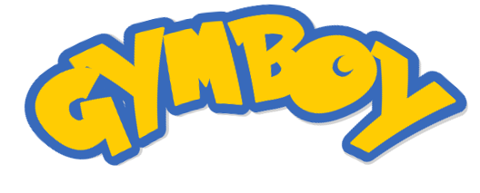
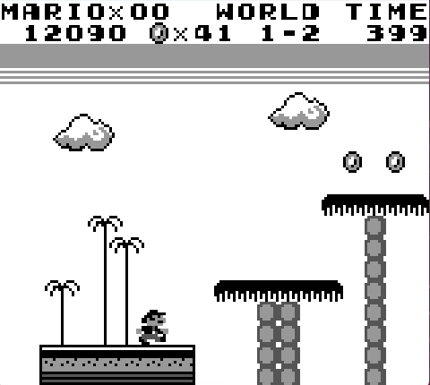

<div align="center">
  
  <h3>Gymboy 🤖 </h3>
</div>

---

<div align="center">
    <h4> Gameboy (Color) Environments in Gymnasium  </h4>
    <a href="https://github.com/astral-sh/ruff">
        
    </a>
    
    <a href="https://github.com/nobodyPerfecZ/gymboy/actions/workflows/lint.yml">
        
    </a>
    <a href="https://github.com/nobodyPerfecZ/gymboy/actions/workflows/test.yml">
        
    </a>
    <a href="https://codecov.io/gh/nobodyPerfecZ/gymboy">
        
    </a>
</div>
<div align="center">

  
  
  
</div>

---

<div align="center">
  <p>Gymboy supports a range of different RL environments from the Game Boy Color using the Gymnasium API.
</p>
</div>

## Implemented Environments 🌍

| Environment Name                      | Python Source                                                                                                             |
| ------------------------------------- | ------------------------------------------------------------------------------------------------------------------------- |
| `Kirby-Dream-Land-1-minimal-image-v1` | [Click](https://github.com/nobodyPerfecZ/gymboy/blob/master/gymboy/environments/kirby/dream_land_1/kirby_dream_land_1.py) |
| `Kirby-Dream-Land-1-full-image-v1`    | [Click](https://github.com/nobodyPerfecZ/gymboy/blob/master/gymboy/environments/kirby/dream_land_1/kirby_dream_land_1.py) |
| `Pokemon-Blue-minimal-image-v1`       | [Click](https://github.com/nobodyPerfecZ/gymboy/blob/master/gymboy/environments/pokemon/gen_1/blue.py)                    |
| `Pokemon-Blue-full-image-v1`          | [Click](https://github.com/nobodyPerfecZ/gymboy/blob/master/gymboy/environments/pokemon/gen_1/blue.py)                    |
| `Pokemon-Gold-minimal-image-v1`       | [Click](https://github.com/nobodyPerfecZ/gymboy/blob/master/gymboy/environments/pokemon/gen_2/gold.py)                    |
| `Pokemon-Gold-full-image-v1`          | [Click](https://github.com/nobodyPerfecZ/gymboy/blob/master/gymboy/environments/pokemon/gen_2/gold.py)                    |
| `Pokemon-Red-minimal-image-v1`        | [Click](https://github.com/nobodyPerfecZ/gymboy/blob/master/gymboy/environments/pokemon/gen_1/red.py)                     |
| `Pokemon-Red-full-image-v1`           | [Click](https://github.com/nobodyPerfecZ/gymboy/blob/master/gymboy/environments/pokemon/gen_1/red.py)                     |
| `Pokemon-Silver-minimal-image-v1`     | [Click](https://github.com/nobodyPerfecZ/gymboy/blob/master/gymboy/environments/pokemon/gen_2/silver.py)                  |
| `Pokemon-Silver-full-image-v1`        | [Click](https://github.com/nobodyPerfecZ/gymboy/blob/master/gymboy/environments/pokemon/gen_2/silver.py)                  |
| `Pokemon-Yellow-minimal-image-v1`     | [Click](https://github.com/nobodyPerfecZ/gymboy/blob/master/gymboy/environments/pokemon/gen_1/yellow.py)                  |
| `Pokemon-Yellow-full-image-v1`        | [Click](https://github.com/nobodyPerfecZ/gymboy/blob/master/gymboy/environments/pokemon/gen_1/yellow.py)                  |
| `Super-Mario-Land-1-minimal-image-v1` | [Click](https://github.com/nobodyPerfecZ/gymboy/blob/master/gymboy/environments/mario/land_1/super_mario_land_1.py)       |
| `Super-Mario-Land-1-full-image-v1`    | [Click](https://github.com/nobodyPerfecZ/gymboy/blob/master/gymboy/environments/mario/land_1/super_mario_land_1.py)       |
| `Tetris-minimal-image-v1`             | [Click](https://github.com/nobodyPerfecZ/gymboy/blob/master/gymboy/environments/tetris/tetris/tetris.py)                  |
| `Tetris-full-image-v1`                | [Click](https://github.com/nobodyPerfecZ/gymboy/blob/master/gymboy/environments/tetris/tetris/tetris.py)                  |

## Installation ⚙️

Install the package via `pip`:

```bash
pip install gymboy
```

> ⚠️ **Important**: Gymboy requires specific ROM files to function properly.
> Make sure you have the necessary ROMs available before using any of the environments.

## Usage 🚀

Here's a quick example of how to use a gymboy environment:

```python
import numpy as np

import gymboy

# Create the environment
env = gymboy.make(
    env_id="Pokemon-Blue-full-image-v1",
    rom_path="./resources/roms/pokemon/gen_1/pokemon_blue.gb",
    init_state_path="./resources/states/pokemon/gen_1/pokemon_blue_after_intro.state",
)
num_steps = 1000

# Reset the environment
observation, info = env.reset()
for i in range(num_steps):
    # Sample a random action
    action = env.action_space.sample()

    # Perform the action
    observation, reward, terminated, truncated, info = env.step(action)
    done = np.logical_or(terminated, truncated)

    if done:
        # Case: Environment has terminated
        break

# Close the environment
env.close()
```

You can also create multiple instances of the environment running in parallel:

```python
import numpy as np

import gymboy

# Create the environments
envs = gymboy.make_vec(
    env_id="Pokemon-Blue-full-image-v1",
    num_envs=2,
    rom_path="./resources/roms/pokemon/gen_1/pokemon_blue.gb",
    init_state_path="./resources/states/pokemon/gen_1/pokemon_blue_after_intro.state",
)
num_steps = 1000

# Reset the environments
observations, infos = envs.reset()
for i in range(num_steps):
    # Sample random actions
    actions = envs.action_space.sample()

    # Perform the actions
    observations, rewards, terminated, truncated, infos = envs.step(actions)
    dones = np.logical_or(terminated, truncated)
    # No need to check for dones — environments auto-reset internally

# Close the environments
envs.close()
```

## Development 🔧

Contributions are welcome!

Please fork the repository and submit a pull request.

Make sure to follow the coding standards and write tests for any new features or
bug fixes.
